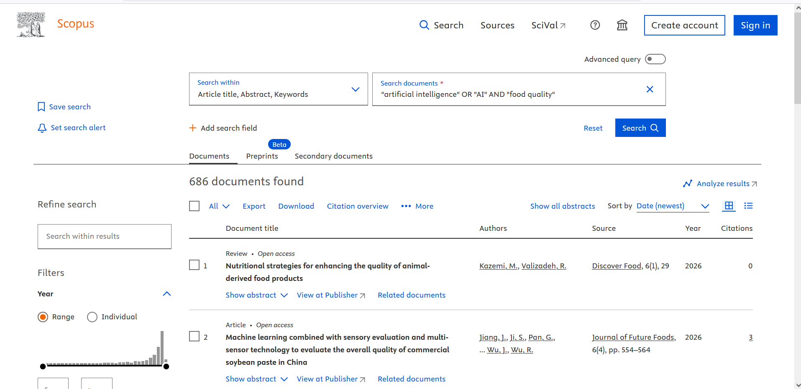
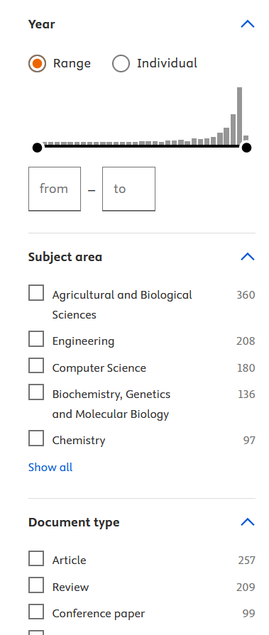

# Professional and Study Skills Assignment

## Enterprise Authoring and Presentation Tools
In this module, we covered Microsoft Word, Powerpoint and Excel. Microsoft Word can be used to create documents, Microsoft Powerpoint can be used to create presentations and Microsoft Excel is a tool used for data management. Throughout my academic and professional career, I have used these tools in various ways. In school, I have used Word to create academic documents for my subjects and Powerpoint for presentations. Before coming starting this module I was already proficient in Word and Powerpoint. Excel, however, I have always struggled with. I haven't used Excel as extensively compared to Word and Powerpoint. By the end of this module, I am far more proficient at Excel than before the module started. In week 5, we were given a data set that consisted of participants, their age and sex, qualification level, last course of study, their access to a laptop, if they have any special needs and if they enjoy group work. I was able to create a graph that shows the correlation between age and qualification levels. One of the advantages of Excel for data management is that you are able to create graphs in a very simple and intuitive way. All you have to do is right click on the columns you wish to represent the axes and click on the desired graph. The downside to this however is that you are not allowed to create any graphs outside of what Microsoft have offered. This creates rigidity in what someone can create with Excel. As I have mentioned before, I was already quite proficient in Microsoft Word. I have used it for a vast range of things such as academic work to CVs. Within this module, I have used Microsoft Word to create a CV. In the "Abubakar Mahamoud.docx" file (which can be found in the repo), I have a title that is my name and a subtitle that is my current role. It shows my experience and skills as well as my education. I used Word to create this CV as it allows to change the font, the size of font, move text to the right, middle or left of the page. The one downside to Microsoft Word is that it can be quite unintuitive. If you want to insert a picture, it may end up shifting the format of the document. Before I started this module, I already had quite an extensive experience using Microsoft Powerpoint. One advantage of Powerpoint is its ease of use. It is quite intuitive in its design and can allow for visually appealing presentation to be made. In the "AI impact on food industry.pptx" presentation, I made use of transitions to create an engaging flow between the slides. Another strong advantage of Powerpoint is that you can pick a design to create a visually appealing presentation. This means that you won't have to create or format a design from scratch. In regards to AI integration within these tools, AI can be used to streamline tasks. Some of theses features in Word are drafting the task, starting from a template, grammar and spelling checking. In Powerpoint, AI integration can be used to get instant feedback on a presentation. It can also be used to format text and graphics with AI recommendations. In Excel, AI integration can be used to format data and highlight key information. It can also be used to give insights to your data and create visualisations. In conclusion, I started this module with a good understanding of Microsoft Word and Powerpoint but was unconfident in Excel and finished with a firmer understanding of these tools. I will further develop my skills for each tool by learning how to format correctly with Microsoft Word, improve my data analysis skills for Excel and better structuring of information within slides in Powerpoint.

## Information Literacy
In this module, we covered how to find academic papers and studies and how to critically judge their quality using modern academic databases such as Scopus and Web of Science. Before I had started this module, I relied mostly on Google Scholar, which has non-peer reviewed studies which can lead to finding biased or incomplete research. The benefit of Scopus is that it only has peer reviewed studies whihch means the information is far more reliable. In Scopus, you can search for studies through key words, authors, affiliation etc. You can use search modifier such as "AND", "OR" and "NOT" to further tighten search results. In the example below, I used the search query "artificial intelligence" OR "AI" AND "food quality" to find peer reviewed studies about how AI has impacted the food industry.

You can further narrow down your search through the use of filters such as year, subject area, document type. These features allow for an effective way to find peer reviewed studies that directly relate to the research topic. 

In this module, we also learnt PICO, a method of structuring academic queries, so that we find accurate and relevant studies. PICO stands for Population (who/what was being investigated), Intervention (the change/condition), Comparison (what you compare against) and Outcome (what you measure). One of the major advantages of is that it allows for a structured question to be asked that will result in effective and relevant studies. For example, in the image below, I used the search query ""artificial intelligence" AND "food quality" AND "food industry"" which resulted in 162 peer reviewed studies regarding AI's impact on the food industry and quality.

Although PICO can create strong structured questions, it can also favour experimental or observational studies by nature. PICO does not account for complexities such as feasibility, context, and sociocultural acceptability. For example the query, ""food industry employees" AND "artifical intelligence" AND "decision making"" results in 0 studies on Scopus. Although this may be because AI itself is experimental, it also results in no studies because something like "decision making" is inherently hard to measure. 

Evaluating sources for credibility is important to academic research

